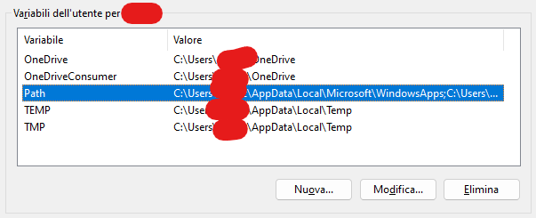
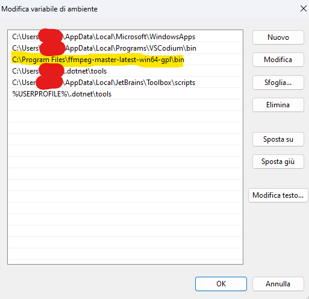
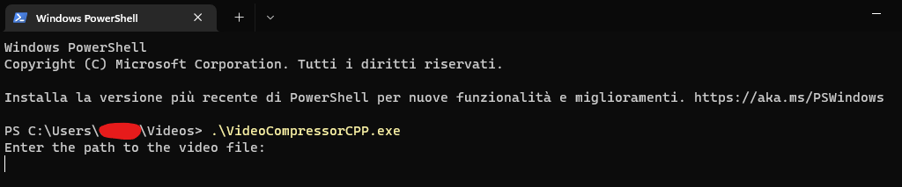

# PREMISE


- This is some ```C++``` code made with the help of ChatGPT to compress any sort of video you give to it into wanted
  format and needed maximum MB.
- Used software
  are [CLion (Gently given by JetBrains with github student license)](https://www.jetbrains.com/clion/) & [Visual C++](https://visualstudio.microsoft.com/)
- Shall you have any issue with the provided software, you can make an issue in the GitHub Issues tab, or (please don't) DM me on Discord (@minimumadhd)

---

# COMPAT

| COMPATS     | WINDOWS | LINUX | MACOS  |
|-------------|---------|-------|--------|
| Can run     | Yes     | Yes   | Unsure |
| Can compile | Yes     | Yes   | //     |

---

# **HOW TO USE**

<details>
<summary>Windows</summary>

* Download the VideoCompressorCPP.exe from releases tab
* Put it somewhere in your PC. (`C:\Users\%USERPROFILE%\Video` or `C:\Users\%USERPROFILE%\OneDrive\Video` is suggested.)
* Install [FFMpeg binaries](https://www.ffmpeg.org/download.html#build-windows) for Windows and insert them somewhere (`C:\Program Files` or `C:\Program Files (x86)` is suggested.)
* Add FFMpeg binaries to Environment Variables (Path)  
* Execute the VideoCompresorCPP.exe and follow instructions (RUN SUGGESTED IN TERMINAL) 

</details>

<details>
<summary>Linux</summary>

* Download the VideoCompressorCPP_LINUX file from releases tab.
* Insert VideoCompressorCPP_LINUX file in `/home/username/Videos`.
* Open terminal and run `sudo apt-get install ffmpeg` (DEBIAN/UBUNTU) or `sudo pacman -S ffmpeg` (ARCH), for others, use distrobox.
* Run `./VideoCompressorCPP_LINUX` and follow instructions.

</details>
